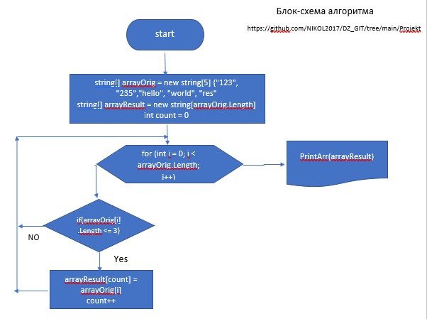

# DZ_GIT
Репозиторий для итоговой контрольной работы
# Projekt1
## Репозиторий создан для решения контрольной задачи
* Написать программу, которая из имеющегося массива строк формирует новый массив из строк, 
* длина которых меньше, либо равна 3 символам. 
* Первоначальный массив можно ввести с клавиатуры, либо задать на старте выполнения алгоритма. 
* При решении не рекомендуется пользоваться коллекциями
* ### Для решения формируем два массива: исходный и результирующий.
* (см.Блок-схему алгоритма ниже)
* Применяем метод, в котором внешний цикл ориентирован на длинну исходного массива, 
* с проверкой заданного условия задачи (<= 3) в цикле.
* Если количество знаков элемента исходного массива меньше или равно трем, то информация вносится в переменную
* count результирующего массива.
* Переменная сount используется как счетчик и увеличивается на 1 и возращается к циклу
